# Dataset 1

| Run | GP Formula | GP Train Fitness | GP Test Fitness | MC Formula | MC Train Fitness | MC Test Fitness |
|-----|------------|------------------|-----------------|------------|------------------|-----------------|
| 1 | sin(x[0]) | 8.397055e-34 | 4.160009e-34 | sin(x[0]) | 5.398107e-34 | 1.115755e-33 |
| 2 | sin(add(subtract(x[0], x[0]), x[0])) | 8.639171e-34 | 3.595069e-34 | sin(x[0]) | 8.044885e-34 | 4.981739e-34 |
| 3 | sin(x[0]) | 5.821811e-34 | 1.016891e-33 | sin(x[0]) | 6.190489e-34 | 9.308661e-34 |
| 4 | sin(x[0]) | 5.821811e-34 | 1.016891e-33 | sin(x[0]) | 5.139482e-34 | 1.176101e-33 |

<table><tr><th>GP Run 1</th><th>MC Run 1</th></tr>
<tr><td> Tree</td><td> Tree</td></tr>
<tr><td>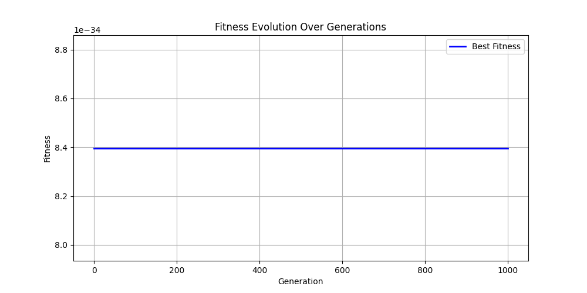 Fitness</td><td>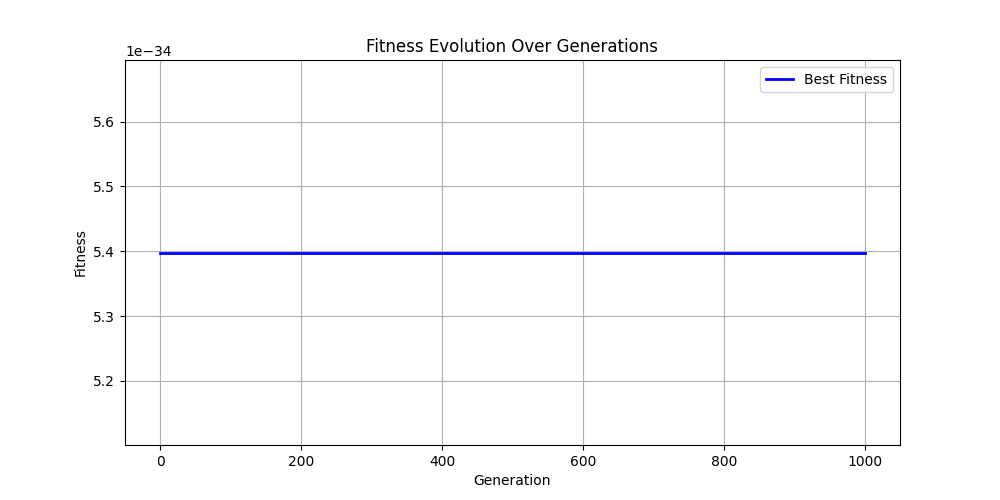 Fitness</td></tr>
<tr><td>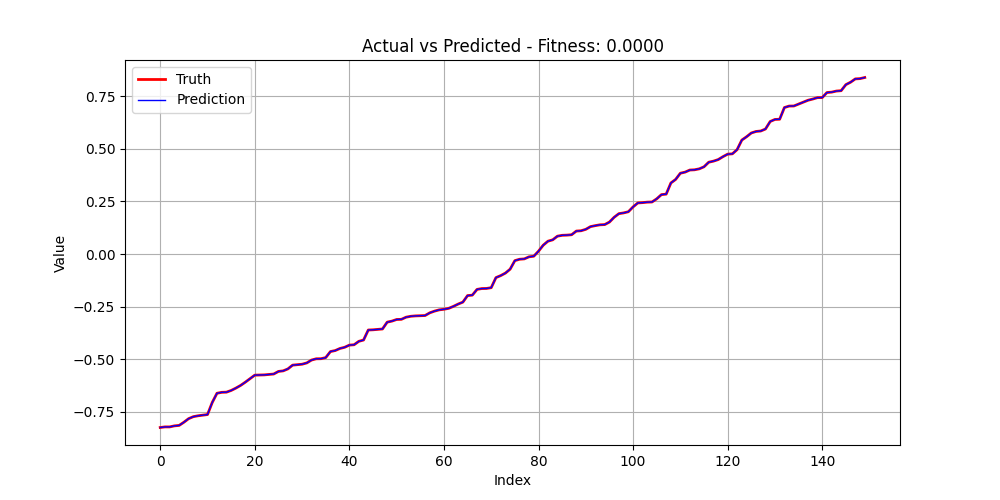 Prediction</td><td>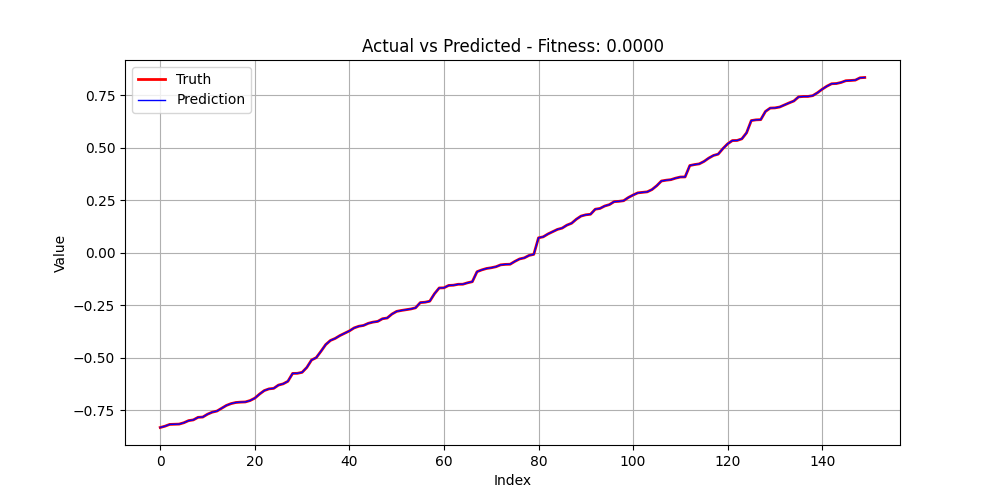 Prediction</td></tr>
</table>

<table><tr><th>GP Run 2</th><th>MC Run 2</th></tr>
<tr><td>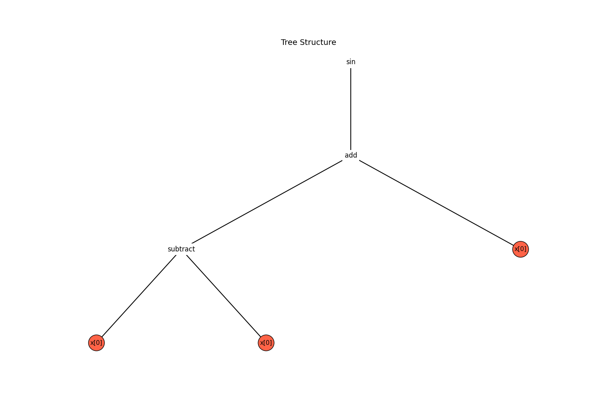 Tree</td><td>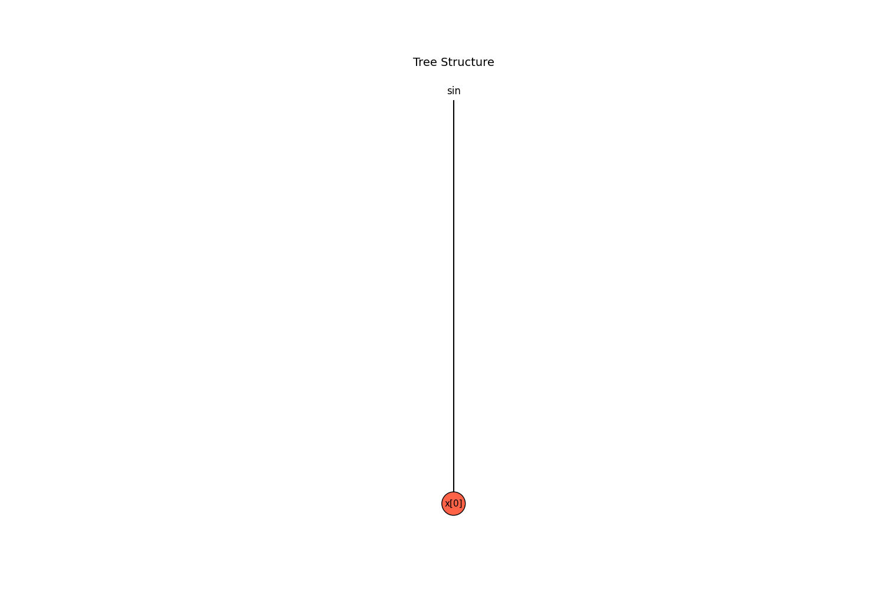 Tree</td></tr>
<tr><td>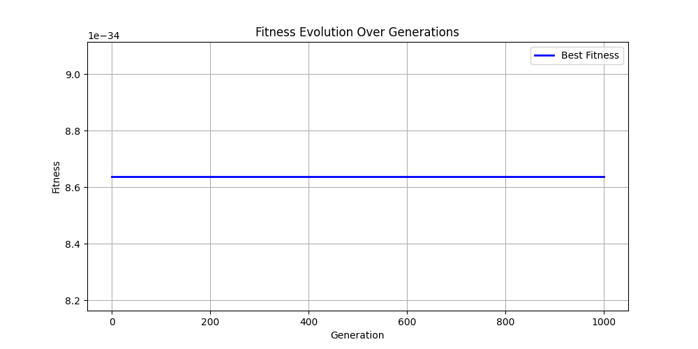 Fitness</td><td>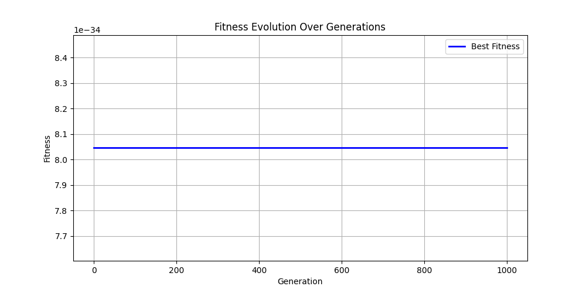 Fitness</td></tr>
<tr><td>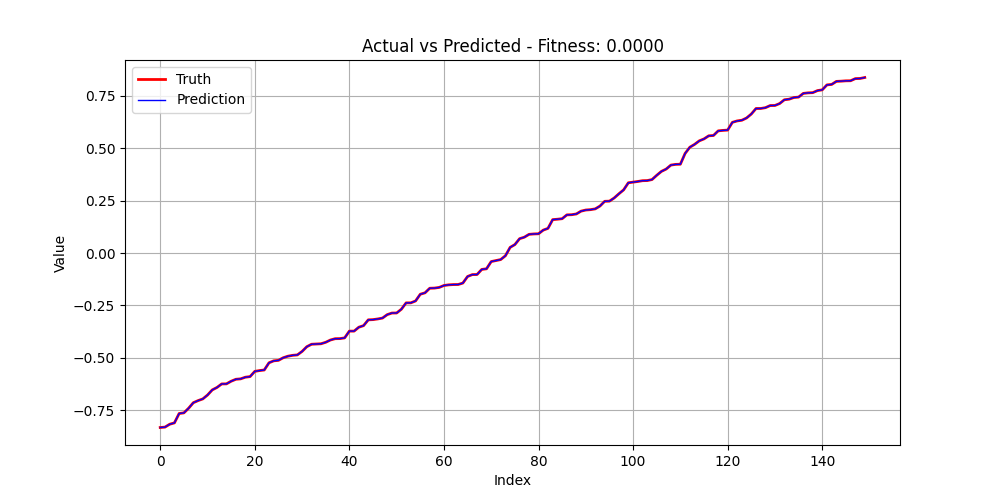 Prediction</td><td>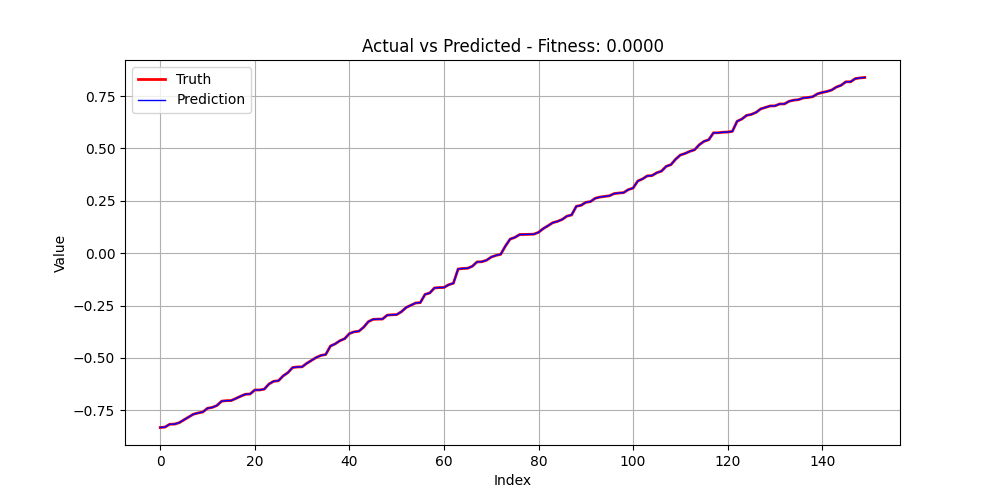 Prediction</td></tr>
</table>

<table><tr><th>GP Run 3</th><th>MC Run 3</th></tr>
<tr><td> Tree</td><td> Tree</td></tr>
<tr><td>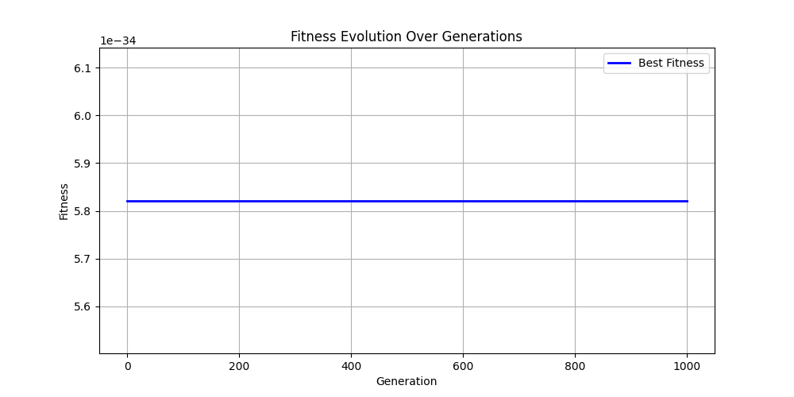 Fitness</td><td> Fitness</td></tr>
<tr><td>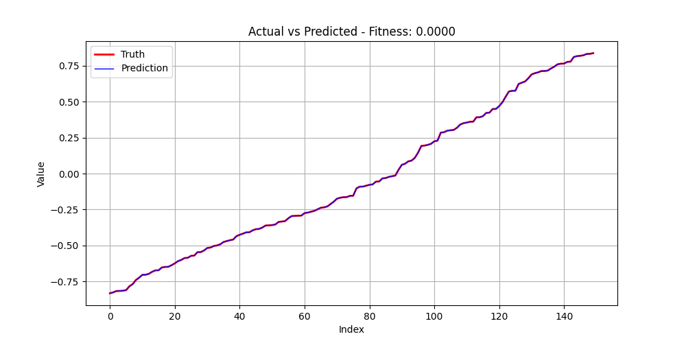 Prediction</td><td>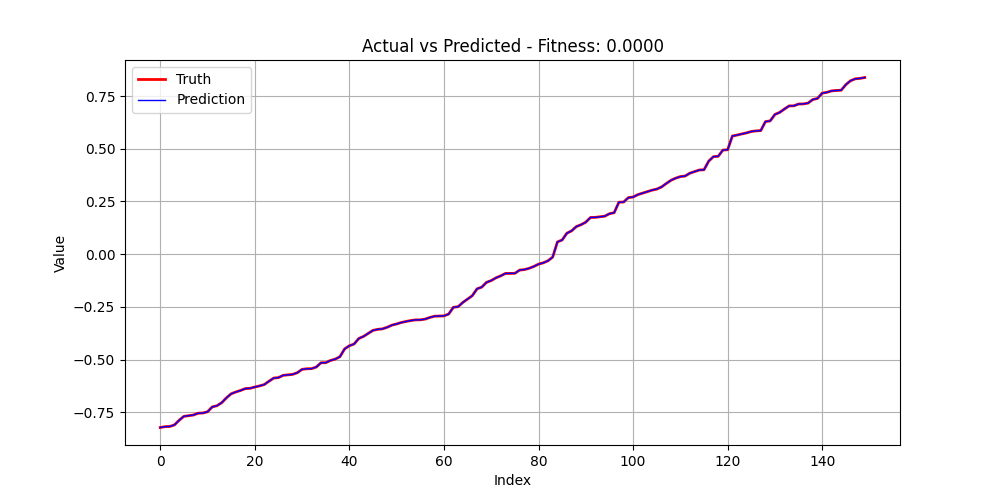 Prediction</td></tr>
</table>

<table><tr><th>GP Run 4</th><th>MC Run 4</th></tr>
<tr><td> Tree</td><td> Tree</td></tr>
<tr><td> Fitness</td><td> Fitness</td></tr>
<tr><td>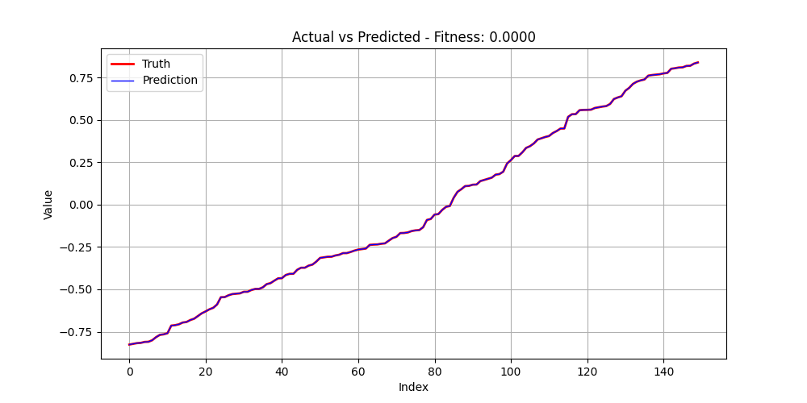 Prediction</td><td>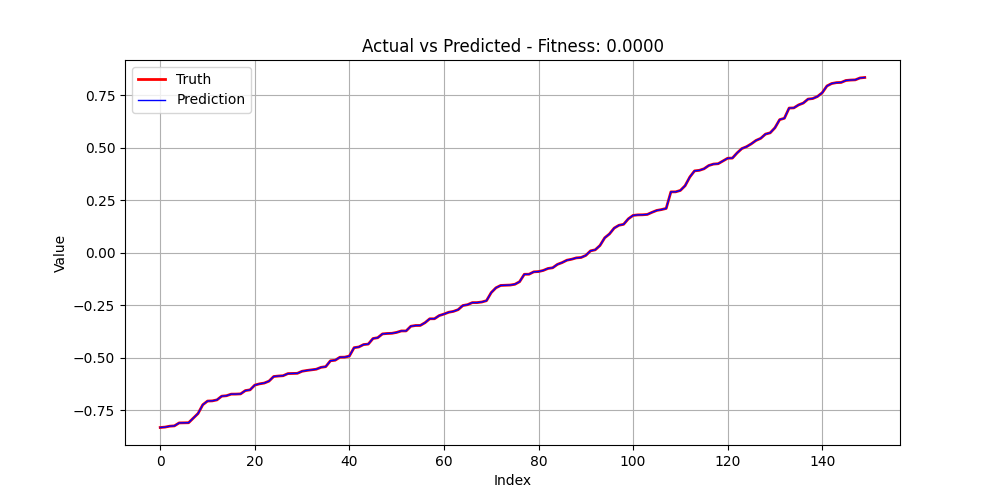 Prediction</td></tr>
</table>

---

