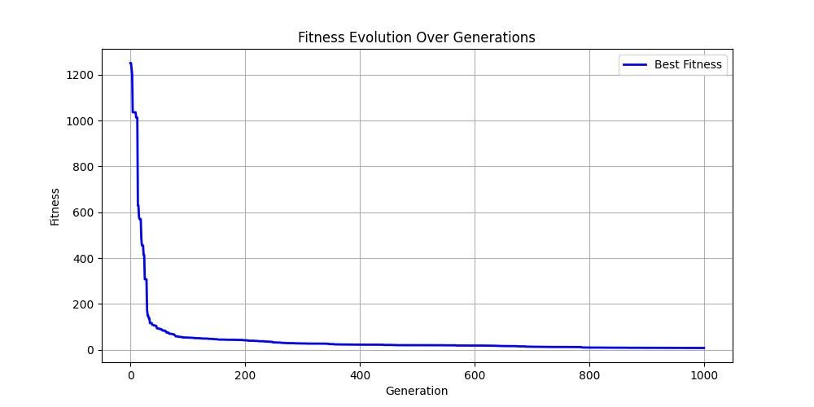

# Dataset 3

| Run | GP Formula | GP Train Fitness | GP Test Fitness | MC Formula | MC Train Fitness | MC Test Fitness |
|-----|------------|------------------|-----------------|------------|------------------|-----------------|
| 1 | subtract(subtract(subtract(reciprocal(reciprocal(negative(multiply(minimum(square(3.141592653589793), subtract(x[1], protected_divide(add(0.0, 0.6931471805599453), 3.141592653589793))), square(x[1]))))), negative(multiply(2.0, square(x[0])))), subtract(add(x[2], maximum(minimum(maximum(add(x[2], protected_divide(x[1], cbrt(protected_mod(0.5, 0.6931471805599453)))), subtract(x[2], protected_divide(maximum(x[2], x[2]), 2.718281828459045))), subtract(minimum(2.718281828459045, subtract(maximum(x[1], x[2]), x[1])), cbrt(cbrt(protected_mod(0.5, 0.6931471805599453))))), subtract(maximum(protected_divide(subtract(add(3.141592653589793, 3.141592653589793), x[2]), x[1]), maximum(cbrt(2.718281828459045), maximum(x[2], x[1]))), protected_divide(add(3.141592653589793, square(subtract(2.718281828459045, x[2]))), square(x[1]))))), 1.7320508075688772)), subtract(add(x[2], maximum(x[2], minimum(square(subtract(0.0, minimum(x[1], protected_divide(x[2], cbrt(x[2]))))), subtract(minimum(square(protected_divide(x[1], cbrt(x[1]))), subtract(maximum(x[2], sinh(x[2])), x[1])), minimum(1.618033988749895, square(protected_divide(x[1], maximum(x[2], x[1])))))))), 1.7320508075688772)) | 9.868158e-02 | 9.865257e-02 | subtract(subtract(subtract(subtract(subtract(subtract(subtract(square(subtract(3.141592653589793, x[1])), sinh(x[1])), square(protected_mod(subtract(negative(1.4142135623730951), sin(x[1])), absolute(x[1])))), add(arctan(subtract(subtract(x[2], sin(x[1])), sin(protected_mod(1.4142135623730951, x[1])))), subtract(add(subtract(3.141592653589793, sin(x[1])), x[2]), maximum(maximum(1.4142135623730951, absolute(x[0])), x[0])))), square(protected_mod(negative(1.4142135623730951), x[1]))), arctan(protected_log2(protected_power(add(x[1], subtract(subtract(sin(x[1]), tan(1.618033988749895)), 0.0)), maximum(sin(absolute(x[0])), sin(add(x[0], 1.4142135623730951))))))), minimum(add(sinh(minimum(add(x[0], 0.6931471805599453), subtract(1.4142135623730951, maximum(maximum(absolute(1.4142135623730951), add(x[0], 0.6931471805599453)), 1.0)))), subtract(add(subtract(subtract(sin(subtract(1.4142135623730951, x[0])), sin(x[1])), sin(subtract(3.141592653589793, x[1]))), subtract(add(3.141592653589793, x[2]), maximum(x[0], maximum(absolute(x[0]), sin(x[1]))))), maximum(sin(x[1]), maximum(subtract(maximum(absolute(x[0]), protected_divide(negative(x[0]), square(2.718281828459045))), sin(add(x[0], 1.4142135623730951))), sin(absolute(x[1])))))), add(maximum(maximum(absolute(x[2]), absolute(maximum(protected_mod(0.6931471805599453, x[1]), 0.0))), add(subtract(3.141592653589793, sin(x[1])), x[2])), square(add(subtract(sin(x[0]), maximum(absolute(x[2]), minimum(square(x[2]), multiply(1.7320508075688772, 1.7320508075688772)))), subtract(subtract(1.0, subtract(1.0, sin(x[1]))), 1.7320508075688772)))))), add(subtract(add(absolute(x[1]), x[2]), maximum(maximum(maximum(maximum(subtract(maximum(absolute(x[0]), sin(x[1])), sin(add(x[0], 1.4142135623730951))), 1.7320508075688772), sin(sin(x[1]))), absolute(subtract(sin(x[2]), sin(x[1])))), maximum(maximum(subtract(maximum(1.4142135623730951, absolute(x[0])), subtract(sin(subtract(1.4142135623730951, x[0])), sin(x[1]))), sin(3.141592653589793)), 1.0))), subtract(subtract(subtract(subtract(1.0, sin(x[1])), sin(x[1])), sin(x[1])), sin(add(x[1], 0.5))))) | 1.330096e+00 | 1.266967e+00 |
| 2 | subtract(subtract(subtract(subtract(square(x[0]), subtract(add(x[2], x[2]), subtract(square(x[0]), sinh(x[1])))), minimum(minimum(add(square(protected_mod(sin(protected_divide(1.7320508075688772, 3.141592653589793)), x[1])), multiply(-1.0, 2.0)), multiply(maximum(protected_log2(subtract(x[1], minimum(2.718281828459045, 3.141592653589793))), reciprocal(add(protected_mod(add(1.7320508075688772, 1.618033988749895), x[1]), x[1]))), multiply(multiply(sin(add(-1.0, x[1])), x[1]), x[1]))), minimum(x[2], protected_divide(multiply(x[1], sin(add(-1.0, add(-1.0, x[1])))), 1.7320508075688772)))), add(add(add(minimum(multiply(sin(add(-1.0, x[1])), add(x[1], -1.0)), sin(add(sin(minimum(-1.0, x[1])), add(minimum(-1.0, x[1]), x[1])))), multiply(sin(multiply(sin(add(-1.0, x[1])), minimum(-1.0, x[1]))), multiply(sin(x[1]), add(multiply(add(-1.0, subtract(x[1], 1.4142135623730951)), sin(add(x[1], 0.6931471805599453))), x[1])))), add(add(sin(sin(add(-1.0, cbrt(x[2])))), multiply(sin(add(-1.0, add(x[1], -1.0))), x[1])), add(sin(sin(add(-1.0, cbrt(x[2])))), multiply(sin(add(-1.0, add(-1.0, x[1]))), x[1])))), x[2])), sinh(x[1])) | 5.037675e-01 | 4.785438e-01 | subtract(subtract(subtract(subtract(square(x[0]), sinh(x[1])), add(add(protected_log10(x[2]), minimum(x[2], add(x[2], add(cos(x[1]), maximum(x[1], cos(x[1])))))), add(minimum(add(square(add(protected_log10(x[2]), maximum(1.0, add(x[2], -1.0)))), cbrt(protected_log2(protected_log2(protected_log(x[1]))))), maximum(add(x[1], maximum(cos(x[2]), x[2])), maximum(maximum(0.0, cos(x[1])), maximum(subtract(x[2], x[1]), x[2])))), minimum(add(maximum(tan(x[1]), maximum(x[1], cos(x[1]))), add(cos(x[1]), maximum(x[1], cos(x[1])))), maximum(cos(cos(cosh(x[1]))), maximum(cos(x[0]), protected_log2(square(x[1])))))))), sinh(x[1])), minimum(add(minimum(minimum(minimum(maximum(x[1], minimum(0.0, x[2])), multiply(minimum(minimum(0.0, minimum(x[0], x[2])), cos(x[1])), negative(x[0]))), add(cos(cos(x[1])), maximum(cos(cos(x[1])), maximum(x[1], protected_log2(0.0))))), minimum(subtract(x[2], 0.0), multiply(minimum(minimum(maximum(square(x[1]), cos(x[1])), x[2]), negative(x[0])), x[0]))), minimum(maximum(minimum(add(maximum(tan(x[1]), maximum(x[1], cos(x[1]))), add(cos(x[1]), maximum(x[1], cos(x[1])))), maximum(cos(cos(cosh(x[2]))), maximum(cos(x[2]), protected_log2(square(x[1]))))), protected_log2(maximum(x[1], cos(x[1])))), maximum(subtract(x[0], sinh(x[1])), subtract(subtract(square(x[1]), sinh(x[1])), add(add(protected_log10(protected_log10(0.0)), 0.0), add(protected_log10(0.0), x[1])))))), multiply(minimum(protected_log10(minimum(cosh(protected_power(x[0], square(x[1]))), protected_log2(cos(cos(x[1]))))), maximum(minimum(minimum(sinh(x[1]), add(arctan(x[1]), subtract(square(x[0]), square(x[1])))), x[1]), x[1])), minimum(0.0, cbrt(protected_log2(cos(maximum(tan(x[2]), maximum(x[1], x[1]))))))))) | 7.368952e+00 | 7.605536e+00 |
| 3 | add(add(add(sinh(subtract(2.718281828459045, protected_divide(x[1], protected_sqrt(2.302585092994046)))), negative(subtract(cosh(x[1]), subtract(square(x[0]), protected_divide(cosh(x[1]), 2.718281828459045))))), negative(subtract(subtract(subtract(subtract(subtract(subtract(protected_sqrt(2.302585092994046), sin(x[1])), sin(x[1])), sin(protected_divide(x[1], cos(2.302585092994046)))), sin(protected_divide(add(1.0, x[1]), 1.0))), arcsin(sin(subtract(2.302585092994046, protected_divide(x[1], arctan(tanh(0.5))))))), negative(subtract(x[2], negative(subtract(x[2], square(x[0])))))))), negative(subtract(subtract(subtract(subtract(protected_divide(subtract(x[1], sin(protected_divide(x[1], 1.0))), protected_sqrt(protected_log2(protected_sqrt(2.302585092994046)))), sin(protected_divide(add(arctan(2.302585092994046), negative(x[1])), tanh(cos(2.302585092994046))))), subtract(negative(subtract(subtract(protected_sqrt(x[2]), sin(x[1])), sin(add(1.0, x[1])))), x[2])), sin(negative(subtract(protected_sqrt(add(2.302585092994046, add(2.302585092994046, x[1]))), sin(protected_divide(x[1], cos(2.302585092994046))))))), negative(subtract(subtract(subtract(subtract(subtract(protected_sqrt(2.302585092994046), sin(x[1])), sin(maximum(x[1], cos(x[1])))), sin(protected_divide(x[1], arctan(2.302585092994046)))), sin(protected_divide(add(1.0, x[1]), arctan(protected_sqrt(2.302585092994046))))), subtract(negative(subtract(protected_sqrt(x[1]), sin(protected_divide(x[1], cos(2.302585092994046))))), subtract(protected_sqrt(subtract(tanh(add(x[2], 1.4142135623730951)), sin(x[1]))), sin(add(protected_log(2.718281828459045), x[1]))))))))) | 1.550039e+00 | 2.005778e+00 | add(negative(sinh(minimum(maximum(negative(sinh(exp(protected_power(2.718281828459045, reciprocal(x[1]))))), sinh(minimum(multiply(protected_log2(multiply(0.6931471805599453, x[1])), multiply(x[1], arctan(x[1]))), multiply(protected_log2(multiply(x[1], x[1])), x[1])))), maximum(x[1], protected_log2(multiply(x[1], x[1])))))), add(add(add(subtract(subtract(subtract(subtract(square(x[0]), x[2]), x[2]), minimum(minimum(minimum(x[1], 3.141592653589793), x[1]), multiply(protected_log2(multiply(x[1], arctan(0.5))), x[1]))), x[2]), subtract(maximum(maximum(square(x[0]), x[0]), subtract(square(x[0]), multiply(cos(protected_mod(1.4142135623730951, protected_log2(1.7320508075688772))), x[2]))), sinh(minimum(exp(protected_power(3.141592653589793, sinh(protected_log(1.4142135623730951)))), x[1])))), minimum(maximum(negative(exp(protected_power(2.718281828459045, sinh(protected_log(1.4142135623730951))))), sinh(minimum(sinh(x[1]), minimum(x[1], x[1])))), minimum(x[1], maximum(x[2], sinh(maximum(x[1], protected_log2(multiply(0.6931471805599453, x[1])))))))), protected_log10(reciprocal(maximum(multiply(multiply(x[1], arctan(0.5)), minimum(x[1], multiply(protected_mod(sin(x[1]), x[2]), minimum(sinh(x[1]), minimum(x[1], x[1]))))), sinh(sinh(minimum(x[1], 3.141592653589793)))))))) | 1.593618e+00 | 1.491090e+00 |
| 4 | protected_divide(subtract(subtract(subtract(subtract(subtract(sinh(x[1]), subtract(cosh(protected_log10(cosh(x[0]))), subtract(subtract(x[1], sin(x[1])), subtract(protected_log10(cosh(x[0])), 1.0)))), subtract(protected_sqrt(protected_log(subtract(maximum(x[1], protected_divide(-1.0, x[1])), sinh(x[1])))), x[2])), subtract(protected_mod(negative(multiply(x[1], subtract(sinh(cos(0.0)), tanh(2.0)))), tanh(exp(protected_power(subtract(tanh(0.6931471805599453), protected_divide(x[1], x[1])), protected_log10(multiply(0.0, x[2])))))), x[2])), square(x[0])), protected_mod(negative(multiply(subtract(x[1], sinh(sin(x[1]))), protected_mod(sinh(subtract(sinh(cos(0.5)), tanh(x[1]))), square(sinh(cosh(reciprocal(2.0))))))), subtract(1.618033988749895, subtract(subtract(subtract(x[1], sinh(sinh(sin(x[1])))), sin(x[1])), subtract(multiply(subtract(sinh(cos(0.0)), tanh(1.618033988749895)), subtract(x[1], sin(sin(x[1])))), tanh(cosh(protected_log10(cosh(x[0]))))))))), subtract(sinh(protected_power(tanh(exp(2.0)), square(sinh(subtract(x[1], sinh(sinh(sin(x[1])))))))), 1.7320508075688772)) | 1.104170e+00 | 1.174724e+00 | subtract(subtract(subtract(subtract(subtract(cosh(x[0]), sinh(x[1])), x[1]), x[1]), subtract(protected_sqrt(subtract(subtract(subtract(subtract(sinh(x[1]), arccos(cos(x[1]))), square(square(1.618033988749895))), add(subtract(square(cbrt(x[0])), add(x[1], x[1])), protected_mod(cos(x[0]), subtract(sinh(3.141592653589793), cosh(x[0]))))), sinh(cbrt(subtract(subtract(sinh(x[1]), x[1]), subtract(cosh(x[1]), sinh(x[1]))))))), add(subtract(cosh(arccos(cos(x[0]))), multiply(x[2], add(protected_power(cosh(sinh(0.0)), x[1]), sinh(1.618033988749895)))), protected_divide(protected_divide(protected_mod(sinh(3.141592653589793), subtract(sinh(3.141592653589793), cosh(x[0]))), 2.0), 1.7320508075688772)))), subtract(subtract(subtract(subtract(sinh(x[1]), cos(add(cbrt(add(x[1], add(x[1], x[1]))), subtract(square(cbrt(1.618033988749895)), add(x[1], x[1]))))), cos(add(cbrt(add(x[1], sinh(x[1]))), subtract(square(sinh(3.141592653589793)), add(minimum(1.4142135623730951, x[1]), x[1]))))), cos(add(cbrt(add(cos(arccos(cos(x[0]))), add(x[1], add(x[1], x[1])))), subtract(square(cbrt(1.618033988749895)), add(x[1], x[1]))))), add(maximum(add(square(1.618033988749895), protected_power(protected_power(square(cosh(sinh(0.0))), subtract(sinh(x[1]), cos(x[0]))), subtract(add(x[1], add(x[1], x[1])), square(sinh(x[1]))))), subtract(sinh(cbrt(subtract(sinh(x[1]), cos(x[0])))), add(subtract(sinh(sinh(1.618033988749895)), cbrt(x[1])), cbrt(add(add(x[1], x[0]), x[1]))))), subtract(sinh(cbrt(sinh(cbrt(subtract(sinh(x[1]), 0.0))))), cbrt(subtract(sinh(x[1]), sinh(cbrt(subtract(sinh(x[1]), cosh(x[1])))))))))) | 2.727225e+00 | 2.938881e+00 |

<table><tr><th>GP Run 1</th><th>MC Run 1</th></tr>
<tr><td> Tree</td><td> Tree</td></tr>
<tr><td> Fitness</td><td> Fitness</td></tr>
<tr><td> Prediction</td><td> Prediction</td></tr>
</table>

<table><tr><th>GP Run 2</th><th>MC Run 2</th></tr>
<tr><td> Tree</td><td> Tree</td></tr>
<tr><td> Fitness</td><td> Fitness</td></tr>
<tr><td> Prediction</td><td> Prediction</td></tr>
</table>

<table><tr><th>GP Run 3</th><th>MC Run 3</th></tr>
<tr><td> Tree</td><td> Tree</td></tr>
<tr><td> Fitness</td><td> Fitness</td></tr>
<tr><td> Prediction</td><td> Prediction</td></tr>
</table>

<table><tr><th>GP Run 4</th><th>MC Run 4</th></tr>
<tr><td> Tree</td><td> Tree</td></tr>
<tr><td> Fitness</td><td> Fitness</td></tr>
<tr><td> Prediction</td><td> Prediction</td></tr>
</table>

---

