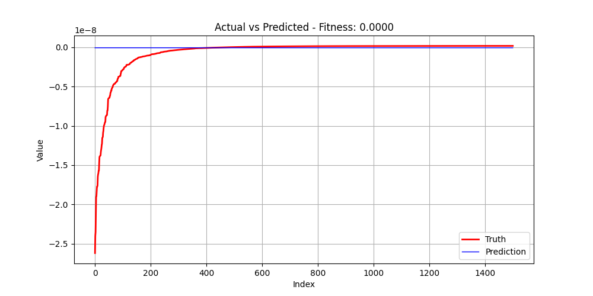

# Dataset 5

| Run | GP Formula | GP Train Fitness | GP Test Fitness | MC Formula | MC Train Fitness | MC Test Fitness |
|-----|------------|------------------|-----------------|------------|------------------|-----------------|
| 1 | multiply(tan(multiply(subtract(square(minimum(subtract(cosh(multiply(negative(protected_log2(x[1])), x[0])), exp(protected_divide(2.302585092994046, protected_log(2.302585092994046)))), minimum(subtract(square(multiply(x[1], x[0])), protected_power(protected_sqrt(protected_mod(x[1], x[0])), add(2.302585092994046, protected_mod(x[0], x[1])))), square(square(multiply(negative(1.4142135623730951), x[1])))))), multiply(minimum(arccos(minimum(multiply(sin(3.141592653589793), exp(x[1])), cos(x[1]))), subtract(reciprocal(protected_divide(multiply(protected_log10(0.5), multiply(x[0], x[1])), maximum(protected_power(2.718281828459045, 1.4142135623730951), x[0]))), subtract(multiply(3.141592653589793, multiply(2.302585092994046, x[0])), multiply(x[0], multiply(x[0], x[1]))))), multiply(multiply(exp(protected_divide(2.718281828459045, protected_log(2.302585092994046))), exp(2.302585092994046)), protected_log10(protected_log10(protected_log(protected_log(2.302585092994046))))))), multiply(multiply(x[1], x[0]), tan(maximum(3.141592653589793, multiply(multiply(x[0], cos(multiply(protected_log(2.718281828459045), cbrt(x[1])))), arctan(cos(multiply(2.302585092994046, x[0]))))))))), multiply(x[1], maximum(maximum(x[1], protected_log10(protected_power(cos(reciprocal(protected_mod(add(1.7320508075688772, negative(3.141592653589793)), 2.718281828459045))), protected_log(arcsin(protected_log(protected_divide(x[0], protected_divide(x[1], 2.718281828459045)))))))), subtract(multiply(3.141592653589793, add(2.302585092994046, protected_divide(3.141592653589793, maximum(x[1], protected_log10(arcsin(tanh(0.0))))))), multiply(maximum(protected_mod(protected_log10(multiply(cos(arccos(x[1])), protected_power(2.718281828459045, 1.4142135623730951))), 2.302585092994046), protected_divide(x[0], protected_log(2.302585092994046))), multiply(x[1], x[0])))))) | 2.527583e-21 | 3.616942e-21 | multiply(exp(protected_log(subtract(arccos(multiply(minimum(protected_divide(minimum(1.7320508075688772, minimum(x[1], reciprocal(2.718281828459045))), x[0]), protected_mod(protected_sqrt(sin(add(x[0], 1.4142135623730951))), cos(2.0))), protected_power(protected_power(add(arctan(1.618033988749895), 2.0), arctan(subtract(protected_power(x[0], -1.0), minimum(x[0], x[0])))), cbrt(x[0])))), tan(maximum(multiply(arcsin(protected_log2(arccos(3.141592653589793))), protected_log2(1.4142135623730951)), x[1]))))), -1.0) | 6.317489e-18 | 3.831366e-18 |
| 2 | protected_divide(multiply(cosh(add(minimum(maximum(multiply(multiply(tanh(cos(subtract(x[1], x[1]))), subtract(3.141592653589793, x[1])), subtract(3.141592653589793, tanh(cos(x[1])))), maximum(maximum(multiply(square(x[1]), subtract(3.141592653589793, x[1])), x[0]), protected_mod(multiply(0.5, subtract(1.0, x[1])), 3.141592653589793))), protected_divide(maximum(2.718281828459045, x[1]), arctan(minimum(cbrt(add(0.5, protected_mod(x[1], 3.141592653589793))), protected_mod(protected_log(multiply(1.4142135623730951, x[1])), x[1]))))), add(arctan(minimum(protected_power(3.141592653589793, subtract(protected_mod(x[1], 3.141592653589793), arctan(protected_divide(x[1], 0.5)))), protected_mod(maximum(3.141592653589793, x[0]), 2.718281828459045))), x[1]))), tan(exp(protected_log(0.0)))), reciprocal(tanh(minimum(subtract(maximum(maximum(multiply(0.5, subtract(0.5, x[1])), arctan(subtract(protected_mod(x[1], 3.141592653589793), 3.141592653589793))), maximum(multiply(0.5, subtract(3.141592653589793, x[1])), arctan(tanh(protected_divide(protected_divide(2.718281828459045, -1.0), x[0]))))), protected_log2(protected_divide(protected_log(x[0]), maximum(1.0, arctan(0.5))))), subtract(minimum(maximum(maximum(arctan(cos(x[1])), x[0]), protected_mod(multiply(0.5, subtract(x[0], x[1])), 3.141592653589793)), subtract(2.718281828459045, tanh(cos(x[1])))), multiply(square(x[0]), minimum(0.5, multiply(subtract(tanh(cos(0.0)), 0.6931471805599453), subtract(square(x[1]), x[1]))))))))) | 5.651115e-21 | 8.795060e-21 | protected_log(tanh(absolute(protected_log10(protected_mod(minimum(2.302585092994046, x[1]), 0.0))))) | 4.731451e-18 | 7.263297e-18 |
| 3 | protected_divide(multiply(square(maximum(subtract(maximum(subtract(add(sinh(maximum(0.0, 1.7320508075688772)), 2.718281828459045), multiply(maximum(add(x[0], protected_sqrt(x[0])), sinh(x[1])), arcsin(arctan(-1.0)))), arcsin(arctan(-1.0))), protected_power(protected_power(sinh(protected_power(0.6931471805599453, 1.0)), maximum(add(x[0], 2.718281828459045), sinh(2.302585092994046))), maximum(minimum(subtract(x[0], maximum(square(2.0), x[1])), add(subtract(x[1], 3.141592653589793), 0.0)), subtract(arccos(0.0), sinh(2.302585092994046))))), protected_divide(protected_mod(multiply(sinh(2.302585092994046), protected_power(0.6931471805599453, maximum(2.302585092994046, x[1]))), subtract(protected_power(arccos(x[0]), 2.718281828459045), multiply(sinh(3.141592653589793), add(3.141592653589793, tan(tan(x[0])))))), cbrt(arccos(sinh(minimum(x[0], subtract(sinh(x[1]), x[1])))))))), protected_divide(cosh(maximum(2.718281828459045, maximum(x[1], sinh(3.141592653589793)))), add(absolute(maximum(reciprocal(0.5), negative(subtract(x[0], maximum(square(2.0), subtract(maximum(0.0, x[1]), protected_log10(0.5))))))), protected_divide(sinh(3.141592653589793), subtract(protected_power(0.6931471805599453, protected_mod(subtract(minimum(2.718281828459045, x[1]), maximum(add(x[0], -1.0), x[1])), x[0])), x[0]))))), tan(arccos(0.0))) | 1.312338e-20 | 1.235384e-20 | protected_divide(tan(protected_divide(maximum(x[0], cbrt(subtract(minimum(protected_power(protected_power(maximum(subtract(x[0], x[0]), x[0]), maximum(protected_power(x[1], x[0]), reciprocal(1.7320508075688772))), cbrt(x[0])), tanh(square(2.302585092994046))), protected_sqrt(x[0])))), sinh(exp(3.141592653589793)))), sinh(protected_divide(arccos(arctan(1.0)), subtract(subtract(tan(2.718281828459045), 0.0), x[1])))) | 4.667677e-18 | 4.734655e-18 |
| 4 | protected_log2(tanh(exp(maximum(add(sinh(subtract(multiply(exp(1.0), add(protected_log2(0.6931471805599453), 0.0)), minimum(protected_divide(x[1], tan(x[0])), subtract(tan(tan(x[0])), protected_log(multiply(x[0], -1.0)))))), subtract(sinh(subtract(cosh(x[1]), multiply(1.618033988749895, exp(x[0])))), subtract(exp(add(protected_divide(tan(x[1]), protected_log2(0.6931471805599453)), tanh(2.0))), multiply(cosh(tan(x[0])), protected_divide(cosh(x[1]), protected_log2(1.618033988749895)))))), add(subtract(protected_divide(protected_log2(tanh(add(tanh(1.618033988749895), 1.618033988749895))), exp(arctan(add(tan(x[0]), tan(x[0]))))), x[1]), protected_mod(sinh(exp(tanh(add(1.4142135623730951, 1.0)))), cosh(exp(1.0)))))))) | 4.012427e-18 | 4.520269e-18 | tan(multiply(protected_divide(subtract(minimum(subtract(1.0, cosh(add(x[0], 0.0))), subtract(sin(x[1]), subtract(cbrt(tan(cosh(subtract(2.0, x[1])))), x[1]))), subtract(x[0], cosh(0.0))), absolute(subtract(absolute(minimum(protected_mod(minimum(exp(x[1]), 1.7320508075688772), sinh(protected_log(-1.0))), protected_divide(reciprocal(protected_mod(x[0], negative(x[1]))), protected_log10(negative(protected_power(x[0], 1.0)))))), 1.0))), 3.141592653589793)) | 5.180269e-18 | 5.370778e-18 |

<table><tr><th>GP Run 1</th><th>MC Run 1</th></tr>
<tr><td> Tree</td><td> Tree</td></tr>
<tr><td> Fitness</td><td> Fitness</td></tr>
<tr><td> Prediction</td><td> Prediction</td></tr>
</table>

<table><tr><th>GP Run 2</th><th>MC Run 2</th></tr>
<tr><td> Tree</td><td> Tree</td></tr>
<tr><td> Fitness</td><td> Fitness</td></tr>
<tr><td> Prediction</td><td> Prediction</td></tr>
</table>

<table><tr><th>GP Run 3</th><th>MC Run 3</th></tr>
<tr><td> Tree</td><td> Tree</td></tr>
<tr><td> Fitness</td><td> Fitness</td></tr>
<tr><td> Prediction</td><td> Prediction</td></tr>
</table>

<table><tr><th>GP Run 4</th><th>MC Run 4</th></tr>
<tr><td> Tree</td><td> Tree</td></tr>
<tr><td> Fitness</td><td> Fitness</td></tr>
<tr><td> Prediction</td><td> Prediction</td></tr>
</table>

---

