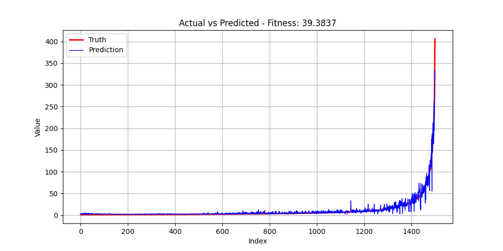
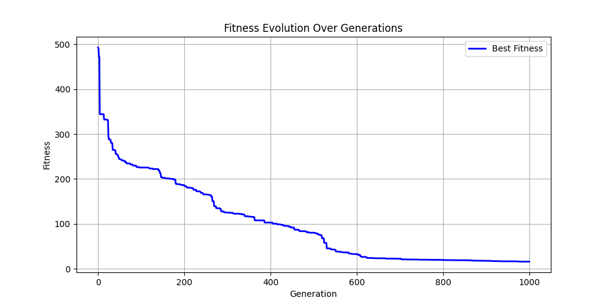
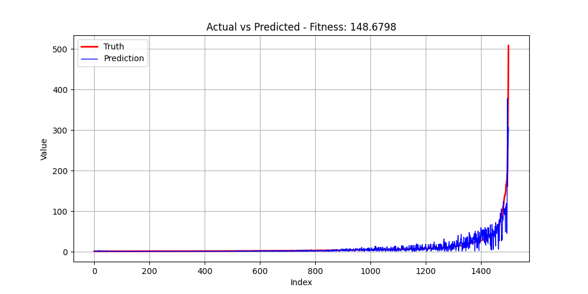

# Dataset 7

| Run | GP Formula | GP Train Fitness | GP Test Fitness | MC Formula | MC Train Fitness | MC Test Fitness |
|-----|------------|------------------|-----------------|------------|------------------|-----------------|
| 1 | multiply(absolute(add(protected_sqrt(multiply(multiply(add(multiply(exp(0.0), x[0]), arctan(arctan(x[0]))), cosh(2.718281828459045)), subtract(x[1], protected_mod(protected_mod(x[1], multiply(multiply(2.302585092994046, x[0]), x[1])), absolute(protected_mod(x[0], x[1])))))), protected_power(protected_sqrt(multiply(protected_divide(x[1], cos(minimum(cos(multiply(x[0], 0.5)), protected_divide(1.4142135623730951, x[0])))), add(add(multiply(2.718281828459045, arctan(x[1])), x[0]), x[1]))), protected_mod(protected_mod(arctan(multiply(x[1], x[1])), protected_divide(multiply(x[0], x[0]), absolute(x[0]))), protected_divide(protected_mod(protected_mod(arctan(multiply(x[0], x[0])), absolute(x[1])), protected_divide(absolute(x[1]), arctan(multiply(x[0], x[0])))), arctan(protected_divide(absolute(x[1]), arctan(multiply(x[0], x[0]))))))))), add(exp(add(protected_mod(protected_mod(protected_mod(protected_mod(arctan(multiply(x[0], x[0])), absolute(absolute(x[1]))), protected_divide(multiply(x[0], x[0]), arctan(multiply(multiply(2.302585092994046, x[0]), x[1])))), protected_divide(absolute(multiply(absolute(x[0]), x[0])), arctan(multiply(x[1], x[1])))), protected_divide(protected_mod(arctan(multiply(x[1], x[1])), protected_divide(multiply(x[0], x[0]), absolute(x[0]))), arctan(protected_divide(absolute(x[0]), arctan(multiply(x[0], x[1])))))), protected_mod(protected_mod(protected_mod(arctan(multiply(x[0], x[0])), absolute(x[1])), protected_divide(absolute(x[1]), arctan(multiply(minimum(sinh(x[1]), x[0]), minimum(x[1], x[0]))))), protected_divide(protected_mod(protected_mod(arctan(multiply(x[0], x[1])), absolute(x[1])), protected_divide(multiply(x[0], arctan(x[0])), arctan(multiply(x[1], x[1])))), sin(arctan(multiply(multiply(2.302585092994046, x[0]), x[0]))))))), cosh(minimum(protected_mod(multiply(x[1], x[1]), protected_divide(multiply(x[0], x[1]), arctan(arctan(multiply(multiply(2.302585092994046, x[0]), sinh(x[1])))))), protected_power(reciprocal(protected_mod(protected_mod(protected_mod(multiply(x[1], x[1]), maximum(2.0, 2.0)), arctan(x[0])), protected_divide(protected_sqrt(multiply(protected_sqrt(1.4142135623730951), protected_mod(x[1], x[0]))), exp(x[0])))), protected_mod(sin(0.5), protected_mod(protected_mod(arctan(x[1]), protected_divide(multiply(x[0], x[0]), absolute(x[0]))), protected_divide(multiply(x[0], arctan(x[1])), arctan(multiply(x[1], x[1])))))))))) | 4.815258e+01 | 9.913298e+01 | protected_power(maximum(add(protected_divide(sinh(maximum(minimum(cos(protected_power(protected_mod(tanh(1.4142135623730951), 0.5), x[1])), add(add(add(x[1], tanh(0.5)), add(x[1], x[1])), protected_log(add(1.0, x[0])))), x[0])), cbrt(subtract(x[1], x[0]))), add(protected_divide(sinh(x[0]), cbrt(cbrt(subtract(x[1], x[0])))), maximum(cbrt(protected_divide(sinh(sinh(x[0])), cbrt(cbrt(subtract(x[1], x[0]))))), subtract(minimum(protected_mod(tanh(0.5), protected_log(subtract(x[1], x[0]))), add(add(subtract(x[1], x[0]), add(0.5, x[1])), protected_log(subtract(x[1], x[0])))), sinh(x[0]))))), sinh(minimum(subtract(subtract(x[0], maximum(add(protected_log(add(x[1], x[0])), x[1]), exp(minimum(-1.0, subtract(x[1], x[1]))))), reciprocal(tan(sin(protected_log10(subtract(exp(0.6931471805599453), negative(1.618033988749895))))))), reciprocal(subtract(minimum(add(subtract(x[1], x[0]), add(subtract(x[1], x[0]), x[1])), x[0]), x[0]))))), 2.0) | 3.498753e+01 | 7.538617e+01 |
| 2 | add(cosh(add(add(add(x[1], x[0]), sin(add(x[1], multiply(cos(x[0]), add(cbrt(add(x[1], x[1])), multiply(cos(x[0]), x[1])))))), sin(add(minimum(square(minimum(arctan(minimum(exp(1.618033988749895), multiply(2.0, x[0]))), square(x[0]))), x[0]), multiply(cos(add(x[1], multiply(cos(x[0]), tanh(x[1])))), add(add(minimum(1.618033988749895, x[0]), x[1]), add(x[1], cbrt(add(x[0], multiply(1.7320508075688772, x[0])))))))))), cosh(add(sin(add(minimum(x[0], minimum(minimum(square(square(x[0])), square(add(x[1], x[0]))), square(square(square(x[0]))))), multiply(cos(add(x[1], multiply(cos(x[0]), sin(cbrt(x[1]))))), add(add(add(sinh(x[1]), minimum(1.618033988749895, x[0])), add(tanh(x[0]), add(minimum(x[1], 1.4142135623730951), x[0]))), add(add(protected_mod(x[1], multiply(1.4142135623730951, x[0])), minimum(1.618033988749895, x[0])), add(x[1], minimum(1.618033988749895, x[0]))))))), add(add(minimum(minimum(add(arctan(absolute(subtract(2.718281828459045, 1.618033988749895))), add(minimum(x[0], x[0]), maximum(multiply(x[0], 0.6931471805599453), x[1]))), minimum(x[0], maximum(multiply(1.618033988749895, 0.6931471805599453), x[1]))), minimum(square(cbrt(add(x[1], x[1]))), x[0])), x[1]), sin(add(add(add(add(x[0], x[1]), x[1]), add(x[1], x[1])), multiply(cos(minimum(square(x[0]), x[0])), add(cbrt(add(x[1], protected_divide(2.302585092994046, x[1]))), add(x[1], sinh(minimum(1.4142135623730951, x[0]))))))))))) | 5.534280e+01 | 3.938368e+01 | absolute(multiply(multiply(maximum(maximum(maximum(reciprocal(square(maximum(protected_divide(x[0], 2.0), x[0]))), maximum(protected_log10(protected_divide(add(multiply(x[1], x[0]), x[1]), subtract(x[0], x[1]))), protected_log10(protected_divide(cosh(2.0), subtract(maximum(x[1], 0.0), x[0]))))), arctan(maximum(arctan(maximum(protected_divide(x[0], x[0]), minimum(x[0], x[1]))), protected_divide(protected_log(-1.0), x[1])))), add(negative(multiply(x[1], add(maximum(x[0], 2.0), maximum(subtract(x[0], x[1]), subtract(x[0], x[0]))))), protected_divide(arctan(subtract(x[0], x[1])), protected_log10(2.302585092994046)))), multiply(maximum(maximum(protected_log10(arctan(arctan(subtract(x[0], x[1])))), subtract(minimum(minimum(protected_log10(2.302585092994046), x[0]), protected_divide(x[0], x[0])), maximum(maximum(protected_divide(x[0], 2.302585092994046), x[1]), subtract(x[1], x[0])))), maximum(minimum(protected_log10(protected_divide(cosh(2.0), subtract(x[0], x[1]))), multiply(x[0], add(2.302585092994046, multiply(2.302585092994046, 2.302585092994046)))), minimum(x[0], x[1]))), maximum(maximum(minimum(x[0], maximum(minimum(x[0], x[1]), negative(subtract(x[1], x[0])))), protected_log10(maximum(minimum(protected_log(-1.0), x[0]), minimum(x[1], 1.4142135623730951)))), subtract(subtract(minimum(maximum(negative(1.618033988749895), x[0]), 0.6931471805599453), maximum(maximum(protected_divide(x[1], 2.302585092994046), x[1]), protected_divide(subtract(x[0], x[1]), protected_log10(1.4142135623730951)))), maximum(maximum(arctan(subtract(x[0], x[1])), x[0]), subtract(x[0], 2.302585092994046)))))), multiply(protected_log10(protected_divide(multiply(protected_divide(x[0], square(maximum(maximum(x[1], x[1]), 2.302585092994046))), maximum(x[0], x[1])), protected_log10(protected_log10(protected_log10(arctan(negative(x[0]))))))), multiply(maximum(maximum(protected_log10(arctan(arctan(subtract(x[0], x[1])))), subtract(subtract(arctan(protected_log(x[0])), maximum(1.618033988749895, 2.302585092994046)), maximum(subtract(cosh(x[0]), negative(sin(x[0]))), maximum(protected_log(x[0]), x[0])))), maximum(minimum(multiply(x[1], add(maximum(x[0], 2.0), protected_mod(2.0, 0.5))), arcsin(1.0)), minimum(protected_log10(protected_divide(cosh(x[0]), subtract(x[1], x[0]))), subtract(maximum(x[0], x[1]), protected_mod(protected_log10(2.302585092994046), subtract(x[0], 3.141592653589793)))))), maximum(maximum(minimum(x[0], maximum(subtract(x[0], protected_mod(protected_power(1.4142135623730951, x[1]), x[0])), protected_log10(multiply(2.302585092994046, 3.141592653589793)))), protected_log10(0.0)), subtract(subtract(minimum(x[1], arctan(protected_log(x[1]))), maximum(maximum(subtract(x[0], 2.0), subtract(x[0], x[0])), x[1])), maximum(x[1], protected_divide(protected_divide(x[0], 2.302585092994046), add(maximum(x[0], 3.141592653589793), protected_mod(x[0], x[0])))))))))) | 1.551386e+01 | 5.583277e+01 |
| 3 | multiply(multiply(x[0], maximum(add(protected_divide(minimum(cbrt(protected_divide(multiply(protected_log2(x[1]), multiply(x[1], x[1])), subtract(maximum(x[1], x[0]), x[0]))), cbrt(protected_divide(multiply(protected_log2(maximum(x[1], x[0])), multiply(x[0], 1.4142135623730951)), subtract(x[1], x[0])))), minimum(protected_divide(protected_mod(protected_divide(protected_log2(x[1]), x[0]), 2.302585092994046), multiply(multiply(x[0], x[0]), x[0])), reciprocal(multiply(1.618033988749895, maximum(x[1], x[0]))))), protected_divide(minimum(cbrt(protected_divide(subtract(multiply(1.4142135623730951, x[0]), protected_divide(x[1], x[1])), subtract(maximum(x[1], x[0]), x[0]))), cbrt(protected_divide(multiply(protected_log2(x[1]), multiply(1.4142135623730951, x[0])), subtract(x[1], x[0])))), minimum(protected_divide(protected_mod(protected_divide(protected_log2(x[1]), x[0]), add(x[1], multiply(1.4142135623730951, x[1]))), multiply(multiply(x[0], 1.4142135623730951), x[0])), reciprocal(multiply(maximum(x[1], x[0]), 1.618033988749895))))), protected_divide(subtract(reciprocal(negative(minimum(sin(sin(multiply(0.5, x[1]))), add(subtract(protected_divide(x[1], x[1]), absolute(1.0)), exp(negative(1.7320508075688772)))))), multiply(maximum(subtract(multiply(1.4142135623730951, x[0]), 0.6931471805599453), sin(multiply(1.4142135623730951, x[1]))), reciprocal(negative(subtract(x[1], x[0]))))), negative(minimum(multiply(1.4142135623730951, x[0]), cbrt(maximum(negative(subtract(x[1], x[0])), protected_divide(x[1], multiply(multiply(x[0], x[0]), x[0]))))))))), x[1]) | 6.401450e+01 | 1.026951e+02 | maximum(2.0, multiply(multiply(maximum(absolute(minimum(sin(exp(1.618033988749895)), protected_divide(protected_log2(subtract(maximum(x[1], x[0]), minimum(x[0], x[1]))), protected_sqrt(arccos(subtract(x[1], x[0])))))), multiply(multiply(add(subtract(sinh(2.718281828459045), exp(maximum(x[0], x[1]))), maximum(maximum(x[1], x[0]), add(3.141592653589793, 3.141592653589793))), square(protected_mod(2.0, 3.141592653589793))), minimum(x[0], x[1]))), minimum(maximum(minimum(x[1], maximum(x[0], tan(protected_log(tan(1.7320508075688772))))), minimum(minimum(x[0], square(sin(2.0))), square(sin(2.0)))), add(square(sin(protected_power(2.302585092994046, minimum(x[0], minimum(x[0], x[1]))))), protected_sqrt(maximum(x[0], tanh(subtract(sinh(2.718281828459045), -1.0))))))), minimum(minimum(multiply(multiply(tanh(minimum(3.141592653589793, maximum(x[0], x[0]))), add(protected_sqrt(square(maximum(x[0], x[1]))), protected_sqrt(square(maximum(x[0], x[1]))))), maximum(protected_power(3.141592653589793, subtract(protected_log2(sinh(2.718281828459045)), square(x[0]))), add(square(maximum(x[0], protected_mod(x[0], x[1]))), protected_sqrt(square(exp(2.0)))))), exp(1.618033988749895)), absolute(minimum(multiply(protected_log2(subtract(maximum(x[1], x[0]), minimum(x[0], x[1]))), protected_divide(protected_power(2.0, subtract(protected_log2(minimum(x[1], x[0])), sinh(arctan(1.4142135623730951)))), protected_log(maximum(x[1], add(2.718281828459045, 3.141592653589793))))), minimum(sin(protected_power(3.141592653589793, 2.0)), minimum(protected_log2(maximum(maximum(x[1], x[0]), maximum(x[0], x[1]))), subtract(sinh(2.718281828459045), exp(maximum(x[0], x[1])))))))))) | 1.615388e+01 | 1.013680e+02 |
| 4 | add(sinh(minimum(maximum(add(minimum(square(x[0]), square(subtract(x[0], add(x[1], x[1])))), add(2.302585092994046, subtract(x[0], x[1]))), add(minimum(square(protected_log2(maximum(protected_divide(multiply(x[0], x[0]), tanh(1.4142135623730951)), 2.302585092994046))), square(protected_mod(subtract(x[0], x[1]), add(maximum(-1.0, maximum(x[0], x[1])), x[1])))), minimum(maximum(subtract(x[0], 2.302585092994046), protected_power(1.618033988749895, minimum(square(x[1]), square(x[0])))), subtract(add(add(2.302585092994046, subtract(absolute(2.0), x[1])), subtract(2.0, x[1])), protected_mod(subtract(multiply(x[1], x[1]), subtract(x[0], x[1])), square(x[0])))))), square(minimum(maximum(protected_power(protected_power(2.0, minimum(square(x[1]), square(x[0]))), minimum(subtract(sinh(cbrt(2.302585092994046)), subtract(x[0], x[1])), add(2.302585092994046, subtract(x[0], x[1])))), tan(cos(subtract(x[0], x[1])))), maximum(add(x[1], 2.718281828459045), minimum(square(square(arctan(3.141592653589793))), protected_mod(subtract(x[0], x[1]), add(absolute(2.0), 2.302585092994046)))))))), cosh(minimum(minimum(protected_sqrt(protected_power(1.7320508075688772, tan(maximum(protected_divide(protected_divide(x[1], protected_log(2.0)), minimum(maximum(x[1], x[0]), cosh(x[0]))), absolute(1.0))))), square(minimum(maximum(protected_power(add(2.302585092994046, 2.302585092994046), minimum(multiply(x[1], x[0]), square(x[0]))), minimum(protected_mod(x[0], subtract(x[1], x[1])), x[0])), maximum(add(subtract(x[0], x[1]), add(2.302585092994046, subtract(x[0], x[1]))), protected_mod(subtract(multiply(x[1], x[0]), x[0]), square(x[0])))))), add(minimum(protected_log2(cbrt(protected_divide(protected_mod(tanh(subtract(x[0], x[1])), cosh(protected_divide(x[1], 2.302585092994046))), subtract(absolute(2.0), sinh(cbrt(x[1])))))), arctan(protected_log10(subtract(x[0], x[1])))), maximum(add(x[1], add(subtract(minimum(multiply(x[1], x[0]), square(x[0])), tanh(subtract(x[0], x[1]))), add(x[1], add(x[1], multiply(0.6931471805599453, x[1]))))), subtract(add(minimum(arctan(add(tan(x[0]), x[1])), arctan(protected_log10(x[0]))), minimum(2.302585092994046, arctan(protected_log10(x[0])))), add(arctan(arctan(x[1])), protected_log2(minimum(square(protected_log10(x[0])), square(x[0])))))))))) | 3.642269e+01 | 1.013833e+02 | cosh(maximum(add(minimum(minimum(minimum(x[1], maximum(add(x[1], sinh(x[1])), maximum(tan(sinh(x[0])), tan(x[1])))), minimum(maximum(add(arctan(protected_power(x[0], -1.0)), x[1]), -1.0), minimum(minimum(x[1], protected_mod(negative(x[0]), add(x[1], x[1]))), minimum(maximum(x[0], x[1]), maximum(x[0], maximum(x[0], -1.0)))))), multiply(maximum(add(x[1], x[1]), maximum(sinh(maximum(x[0], x[1])), tan(tan(x[0])))), maximum(maximum(multiply(square(minimum(x[1], 1.7320508075688772)), tan(negative(cbrt(x[0])))), sinh(add(2.718281828459045, sin(x[0])))), 2.718281828459045))), add(minimum(minimum(maximum(minimum(1.7320508075688772, maximum(sinh(x[0]), maximum(x[0], cos(0.6931471805599453)))), tan(sinh(maximum(x[0], x[1])))), maximum(maximum(sinh(x[1]), protected_log2(x[0])), add(sinh(add(1.7320508075688772, sin(x[0]))), sinh(x[1])))), minimum(maximum(sinh(sinh(x[1])), maximum(tan(cosh(x[0])), tan(x[1]))), maximum(tan(cbrt(x[0])), maximum(0.0, sinh(x[1]))))), minimum(minimum(maximum(add(maximum(x[0], x[1]), x[1]), -1.0), minimum(2.718281828459045, sinh(x[1]))), maximum(minimum(minimum(maximum(x[0], reciprocal(x[1])), maximum(sinh(x[0]), x[0])), x[1]), protected_mod(sinh(x[1]), protected_mod(maximum(cosh(x[0]), protected_power(x[1], protected_log(3.141592653589793))), add(arctan(protected_power(x[0], -1.0)), sinh(x[1])))))))), add(subtract(maximum(x[0], x[1]), sinh(sin(protected_power(cosh(sinh(minimum(x[0], x[1]))), tanh(tanh(add(sin(0.0), protected_divide(-1.0, x[1])))))))), add(minimum(maximum(tan(maximum(tan(x[0]), sinh(x[1]))), cbrt(x[0])), minimum(protected_power(cosh(maximum(1.618033988749895, x[0])), minimum(x[0], sinh(x[1]))), maximum(x[0], x[1]))), minimum(x[0], protected_mod(cosh(x[0]), minimum(x[1], sinh(x[1])))))))) | 9.130635e+01 | 1.486798e+02 |

<table><tr><th>GP Run 1</th><th>MC Run 1</th></tr>
<tr><td> Tree</td><td> Tree</td></tr>
<tr><td> Fitness</td><td> Fitness</td></tr>
<tr><td> Prediction</td><td> Prediction</td></tr>
</table>

<table><tr><th>GP Run 2</th><th>MC Run 2</th></tr>
<tr><td> Tree</td><td> Tree</td></tr>
<tr><td> Fitness</td><td> Fitness</td></tr>
<tr><td> Prediction</td><td> Prediction</td></tr>
</table>

<table><tr><th>GP Run 3</th><th>MC Run 3</th></tr>
<tr><td> Tree</td><td> Tree</td></tr>
<tr><td> Fitness</td><td> Fitness</td></tr>
<tr><td> Prediction</td><td> Prediction</td></tr>
</table>

<table><tr><th>GP Run 4</th><th>MC Run 4</th></tr>
<tr><td> Tree</td><td> Tree</td></tr>
<tr><td> Fitness</td><td> Fitness</td></tr>
<tr><td> Prediction</td><td> Prediction</td></tr>
</table>

---

