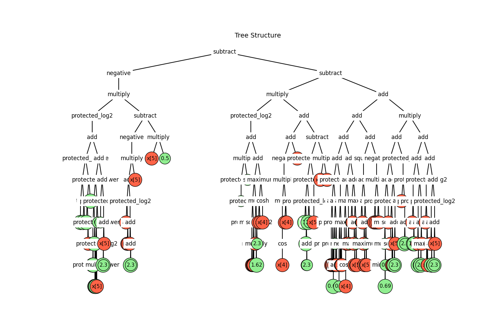

# Dataset 8

| Run | GP Formula | GP Train Fitness | GP Test Fitness | MC Formula | MC Train Fitness | MC Test Fitness |
|-----|------------|------------------|-----------------|------------|------------------|-----------------|
| 1 | add(add(add(sinh(subtract(minimum(x[5], x[3]), sinh(1.4142135623730951))), add(sinh(subtract(x[5], 2.302585092994046)), add(sinh(subtract(add(absolute(x[5]), x[5]), cbrt(x[5]))), add(subtract(sinh(x[5]), add(protected_log(protected_log(x[5])), protected_log(add(x[5], 1.4142135623730951)))), add(sinh(subtract(x[5], 3.141592653589793)), sinh(add(cosh(2.302585092994046), x[5]))))))), sinh(subtract(add(x[5], x[5]), cbrt(add(protected_log(cosh(subtract(x[5], 3.141592653589793))), add(protected_log(cosh(subtract(x[5], 3.141592653589793))), protected_log(add(x[5], subtract(x[5], 2.302585092994046))))))))), add(subtract(add(subtract(subtract(subtract(subtract(subtract(sinh(x[3]), cosh(x[4])), protected_log(add(x[5], 1.4142135623730951))), add(protected_log(protected_log(x[5])), protected_log(add(x[5], 2.302585092994046)))), add(add(protected_log(add(x[5], 2.302585092994046)), subtract(add(x[5], 1.4142135623730951), sinh(x[5]))), subtract(cosh(x[1]), subtract(sinh(x[3]), cosh(x[4]))))), add(add(add(protected_log(add(x[5], protected_power(x[0], 0.0))), subtract(protected_log(x[5]), sinh(x[5]))), add(protected_log(add(x[5], 2.302585092994046)), subtract(protected_log(x[5]), sinh(x[5])))), subtract(add(protected_log(add(x[5], 2.302585092994046)), subtract(add(x[5], x[5]), sinh(x[5]))), subtract(subtract(sinh(x[3]), cosh(3.141592653589793)), cosh(x[4]))))), subtract(add(protected_mod(2.718281828459045, sinh(protected_mod(arccos(sinh(0.6931471805599453)), x[5]))), subtract(subtract(subtract(cosh(x[3]), minimum(x[5], 2.302585092994046)), add(protected_log(x[5]), protected_log(x[5]))), add(protected_log(add(1.4142135623730951, x[5])), subtract(protected_log(x[5]), sinh(x[5]))))), add(add(add(add(cosh(x[5]), add(x[5], x[5])), add(protected_log(x[5]), protected_log(x[5]))), subtract(protected_log(add(x[5], subtract(2.302585092994046, 0.5))), subtract(sinh(x[5]), maximum(x[5], x[5])))), add(protected_log(add(subtract(x[5], 2.302585092994046), add(x[5], x[5]))), subtract(protected_log(protected_log(x[5])), sinh(x[5])))))), add(add(add(add(add(protected_log(add(x[5], 1.4142135623730951)), protected_log(protected_log(x[5]))), add(add(protected_log(x[5]), protected_log(x[5])), protected_log(protected_log(x[5])))), subtract(add(protected_log(add(x[5], 2.302585092994046)), subtract(cosh(x[4]), sinh(x[5]))), subtract(sinh(x[5]), cosh(cosh(2.302585092994046))))), add(add(protected_log(add(x[5], cosh(1.4142135623730951))), add(protected_log(add(x[5], 1.4142135623730951)), subtract(cosh(x[4]), sinh(x[5])))), subtract(protected_log(add(sinh(x[5]), add(x[5], 1.7320508075688772))), subtract(sinh(x[5]), cosh(cosh(2.302585092994046)))))), add(add(add(add(protected_log(add(x[5], 1.4142135623730951)), subtract(protected_log(x[5]), sinh(x[5]))), add(protected_log(add(x[5], 1.4142135623730951)), protected_log(add(x[5], 1.4142135623730951)))), subtract(protected_log(add(x[5], cosh(1.4142135623730951))), subtract(cosh(x[3]), protected_log(add(x[5], subtract(0.0, 1.618033988749895)))))), add(add(add(protected_log(add(x[5], 2.302585092994046)), subtract(add(x[5], x[5]), sinh(x[5]))), add(protected_log(add(x[5], minimum(3.141592653589793, 2.0))), protected_log(add(x[5], 0.6931471805599453)))), subtract(protected_log(add(x[5], sinh(1.4142135623730951))), subtract(sinh(x[5]), cosh(cosh(2.302585092994046)))))))), add(sinh(subtract(x[5], cosh(2.302585092994046))), sinh(subtract(minimum(cosh(x[5]), add(subtract(x[5], 3.141592653589793), subtract(-1.0, x[5]))), protected_log(cosh(x[4]))))))) | 2.132428e+04 | 2.163680e+04 | add(subtract(sinh(subtract(sinh(cbrt(multiply(minimum(negative(x[4]), minimum(negative(1.7320508075688772), x[4])), arccos(0.0)))), cosh(cosh(1.4142135623730951)))), subtract(add(subtract(maximum(multiply(cosh(cosh(arccos(0.0))), multiply(cosh(x[4]), cosh(1.618033988749895))), exp(minimum(cosh(cosh(1.4142135623730951)), multiply(x[5], cosh(2.302585092994046))))), multiply(x[3], cosh(x[3]))), maximum(cosh(multiply(minimum(minimum(cosh(x[5]), 2.302585092994046), x[5]), 1.4142135623730951)), multiply(cosh(minimum(cosh(x[5]), multiply(protected_log(sin(2.0)), cosh(x[5])))), minimum(cosh(multiply(x[5], cosh(x[3]))), minimum(multiply(x[5], 1.4142135623730951), cosh(multiply(0.5, x[5]))))))), maximum(minimum(multiply(protected_divide(minimum(subtract(cos(0.5), tan(multiply(x[5], 0.5))), exp(cosh(x[5]))), exp(x[5])), exp(sinh(cosh(1.4142135623730951)))), exp(cosh(2.302585092994046))), sinh(cbrt(multiply(x[5], exp(cosh(cosh(reciprocal(0.6931471805599453)))))))))), add(add(sinh(subtract(add(x[5], sinh(cbrt(multiply(x[5], cosh(1.4142135623730951))))), 0.0)), subtract(sinh(cbrt(multiply(exp(cosh(cosh(1.4142135623730951))), minimum(cosh(multiply(0.5, x[5])), x[5])))), negative(exp(cosh(2.302585092994046))))), add(subtract(sinh(cbrt(multiply(exp(cosh(cosh(1.4142135623730951))), minimum(cosh(multiply(0.5, x[5])), x[5])))), minimum(negative(multiply(exp(multiply(1.4142135623730951, 1.4142135623730951)), exp(x[5]))), cbrt(multiply(multiply(multiply(minimum(1.4142135623730951, x[5]), 2.302585092994046), sinh(2.302585092994046)), exp(cosh(3.141592653589793)))))), sinh(subtract(add(x[5], sinh(cbrt(multiply(cosh(1.4142135623730951), x[5])))), minimum(0.0, 1.4142135623730951)))))) | 3.019043e+04 | 3.060096e+04 |
| 2 | subtract(minimum(minimum(multiply(x[4], subtract(subtract(multiply(x[4], subtract(square(cosh(x[5])), cosh(x[4]))), multiply(absolute(x[4]), protected_log2(subtract(x[4], sinh(x[5]))))), sinh(x[3]))), subtract(square(protected_log2(subtract(protected_log2(protected_log2(square(x[4]))), absolute(subtract(square(protected_mod(x[0], x[2])), sinh(x[5])))))), multiply(x[5], minimum(subtract(multiply(square(x[5]), sinh(x[5])), subtract(protected_mod(cos(x[5]), sinh(x[5])), protected_log2(cos(x[5])))), protected_mod(tanh(add(x[3], 0.0)), minimum(0.0, tanh(protected_power(protected_divide(2.302585092994046, 2.302585092994046), 0.6931471805599453)))))))), minimum(multiply(x[4], subtract(multiply(absolute(x[4]), protected_log2(multiply(subtract(x[4], x[5]), subtract(square(x[5]), cosh(x[4]))))), multiply(x[4], subtract(negative(subtract(x[3], sinh(x[5]))), subtract(square(square(x[5])), sinh(x[4])))))), minimum(multiply(x[4], subtract(subtract(multiply(x[4], subtract(cosh(x[5]), cosh(x[4]))), maximum(add(sinh(x[4]), protected_divide(protected_log2(x[4]), subtract(-1.0, 0.0))), subtract(-1.0, square(x[5])))), protected_log2(multiply(sinh(protected_log2(x[4])), subtract(cosh(x[4]), square(x[5])))))), subtract(square(protected_log2(x[5])), multiply(x[5], minimum(multiply(absolute(square(x[5])), protected_log2(-1.0)), add(subtract(square(x[5]), cosh(x[5])), protected_divide(protected_log2(x[4]), subtract(-1.0, 0.0))))))))), multiply(minimum(multiply(sinh(x[5]), protected_log2(maximum(protected_log2(multiply(square(x[4]), protected_log2(sinh(x[5])))), minimum(arcsin(subtract(square(x[5]), sinh(x[5]))), protected_log2(square(x[5])))))), subtract(multiply(square(x[5]), protected_log2(protected_log2(protected_log2(subtract(x[5], x[5]))))), subtract(multiply(multiply(multiply(x[4], subtract(subtract(negative(x[4]), x[4]), sinh(x[4]))), cos(exp(protected_sqrt(multiply(0.0, x[0]))))), multiply(x[5], 0.5)), subtract(subtract(multiply(square(x[5]), protected_log2(sinh(x[5]))), multiply(absolute(2.718281828459045), protected_log2(sinh(x[5])))), multiply(absolute(add(sinh(arctan(3.141592653589793)), protected_sqrt(subtract(x[3], 0.0)))), protected_log2(sin(protected_log(protected_divide(x[3], x[5]))))))))), x[5])) | 9.020473e+04 | 8.827540e+04 | protected_divide(maximum(negative(minimum(subtract(add(add(multiply(2.718281828459045, sinh(x[5])), subtract(multiply(3.141592653589793, multiply(2.718281828459045, 2.718281828459045)), multiply(x[5], minimum(x[3], x[5])))), protected_mod(multiply(2.718281828459045, 2.718281828459045), add(multiply(2.718281828459045, sinh(x[5])), multiply(2.718281828459045, protected_power(1.618033988749895, 1.7320508075688772))))), cosh(negative(x[4]))), add(add(add(add(x[5], multiply(sinh(x[5]), 2.718281828459045)), sinh(x[5])), subtract(subtract(exp(0.5), x[3]), multiply(add(minimum(1.618033988749895, x[5]), subtract(x[5], x[3])), minimum(protected_power(1.618033988749895, 1.7320508075688772), square(1.618033988749895))))), multiply(multiply(multiply(multiply(2.718281828459045, multiply(2.718281828459045, 2.718281828459045)), add(3.141592653589793, protected_log10(exp(2.302585092994046)))), cosh(negative(x[4]))), multiply(reciprocal(protected_log2(minimum(2.718281828459045, x[5]))), protected_log10(2.718281828459045)))))), negative(add(add(multiply(add(subtract(multiply(minimum(2.718281828459045, x[5]), multiply(2.718281828459045, 2.718281828459045)), multiply(x[5], x[5])), subtract(add(protected_log10(protected_power(x[5], 1.7320508075688772)), subtract(x[5], x[3])), multiply(x[5], x[5]))), add(multiply(minimum(2.718281828459045, x[5]), 2.718281828459045), subtract(multiply(minimum(2.718281828459045, x[5]), multiply(2.718281828459045, 2.718281828459045)), multiply(x[5], x[5])))), subtract(add(multiply(negative(sinh(x[5])), multiply(add(2.718281828459045, 1.618033988749895), 2.718281828459045)), multiply(multiply(square(1.618033988749895), multiply(2.718281828459045, 2.718281828459045)), cosh(negative(x[4])))), subtract(multiply(multiply(square(1.618033988749895), square(1.618033988749895)), sinh(x[5])), multiply(multiply(subtract(x[5], x[3]), add(x[5], 1.618033988749895)), 2.718281828459045)))), multiply(multiply(sinh(x[5]), 2.718281828459045), protected_log(protected_log(reciprocal(x[5]))))))), reciprocal(protected_log2(x[5]))) | 1.208955e+05 | 1.241177e+05 |
| 3 | multiply(protected_log(multiply(protected_log(minimum(subtract(multiply(maximum(2.302585092994046, tanh(cosh(protected_log(1.7320508075688772)))), x[5]), protected_log2(add(negative(maximum(x[3], 3.141592653589793)), add(cosh(x[4]), tanh(x[5]))))), negative(multiply(tan(square(1.4142135623730951)), multiply(protected_power(maximum(cbrt(x[2]), protected_power(1.4142135623730951, 3.141592653589793)), 2.302585092994046), protected_power(2.302585092994046, x[5])))))), square(square(subtract(subtract(multiply(maximum(arccos(protected_log10(0.6931471805599453)), x[5]), maximum(square(x[4]), protected_power(2.302585092994046, x[5]))), square(x[4])), add(cosh(x[4]), tanh(sinh(-1.0)))))))), square(maximum(square(x[5]), add(cbrt(protected_divide(add(subtract(add(cosh(x[4]), tanh(x[5])), add(maximum(x[3], 3.141592653589793), x[3])), tan(square(1.4142135623730951))), add(add(maximum(maximum(1.7320508075688772, x[3]), subtract(2.718281828459045, protected_mod(x[5], 2.302585092994046))), protected_power(1.4142135623730951, tan(2.302585092994046))), protected_power(add(maximum(1.7320508075688772, x[3]), cosh(x[3])), tan(tan(2.302585092994046)))))), protected_log2(maximum(protected_divide(add(add(tan(1.7320508075688772), cosh(x[4])), tan(1.7320508075688772)), add(protected_power(2.302585092994046, x[5]), add(protected_power(maximum(0.0, 3.141592653589793), x[5]), protected_power(2.302585092994046, x[5])))), add(subtract(add(cosh(x[4]), tan(2.302585092994046)), add(protected_power(3.141592653589793, x[5]), x[3])), tan(tan(2.302585092994046))))))))) | 4.234143e+05 | 4.235963e+05 | add(subtract(subtract(multiply(multiply(multiply(2.302585092994046, square(x[5])), multiply(square(x[5]), 2.302585092994046)), x[5]), square(multiply(square(x[4]), 2.302585092994046))), protected_divide(multiply(x[5], multiply(multiply(protected_log(square(x[5])), protected_log(multiply(square(x[5]), 1.7320508075688772))), square(x[5]))), 1.7320508075688772)), protected_log2(add(minimum(multiply(add(protected_mod(arctan(arctan(arctan(x[3]))), 1.4142135623730951), arctan(subtract(1.618033988749895, 2.302585092994046))), protected_mod(arctan(3.141592653589793), sinh(sinh(x[3])))), multiply(multiply(square(arctan(protected_log(square(x[5])))), square(multiply(2.302585092994046, protected_divide(2.302585092994046, add(1.7320508075688772, x[1]))))), square(x[3]))), maximum(subtract(exp(add(multiply(sinh(x[3]), 3.141592653589793), multiply(multiply(x[3], 2.302585092994046), 3.141592653589793))), multiply(square(exp(square(x[1]))), square(multiply(square(square(x[3])), multiply(sinh(x[3]), 3.141592653589793))))), maximum(protected_divide(sinh(add(multiply(square(x[4]), square(x[4])), multiply(square(x[4]), minimum(subtract(x[3], 1.7320508075688772), x[3])))), square(minimum(x[5], sinh(sinh(x[3]))))), protected_divide(exp(add(multiply(square(x[4]), square(x[3])), multiply(x[3], multiply(x[3], 3.141592653589793)))), protected_log2(sinh(arctan(arctan(x[3])))))))))) | 5.276174e+03 | 5.197644e+03 |
| 4 | subtract(negative(multiply(protected_log2(add(protected_divide(add(tan(1.618033988749895), add(1.7320508075688772, 2.302585092994046)), add(add(1.7320508075688772, maximum(2.302585092994046, x[5])), 1.7320508075688772)), add(protected_power(add(protected_log2(multiply(1.618033988749895, 1.618033988749895)), add(1.7320508075688772, maximum(protected_sqrt(1.7320508075688772), protected_log(2.718281828459045)))), subtract(protected_power(maximum(square(x[5]), protected_power(1.7320508075688772, 0.0)), protected_log2(multiply(0.5, x[5]))), 0.0)), add(protected_log2(2.302585092994046), protected_log2(add(add(1.7320508075688772, 2.302585092994046), x[5])))))), subtract(negative(multiply(add(add(x[5], add(x[5], x[5])), protected_log2(add(x[5], add(1.7320508075688772, 2.302585092994046)))), x[5])), multiply(x[5], 0.5)))), subtract(multiply(protected_log2(add(multiply(protected_log2(0.0), 2.302585092994046), add(subtract(protected_power(protected_log2(multiply(0.5, x[5])), maximum(multiply(x[4], x[4]), square(x[5]))), add(square(x[5]), add(multiply(x[4], 1.618033988749895), 2.302585092994046))), maximum(multiply(x[4], x[4]), cosh(x[4]))))), add(add(negative(multiply(arctan(exp(cos(x[4]))), multiply(x[4], x[4]))), x[3]), subtract(protected_power(maximum(protected_power(1.7320508075688772, add(1.7320508075688772, add(2.302585092994046, 2.302585092994046))), add(1.7320508075688772, 2.302585092994046)), protected_log2(protected_log2(x[5]))), multiply(x[4], x[4])))), add(add(add(add(add(add(negative(cosh(x[4])), add(multiply(x[4], x[4]), protected_log(tan(0.6931471805599453)))), add(add(square(x[5]), 2.302585092994046), maximum(multiply(x[4], x[4]), square(x[5])))), protected_log2(add(protected_mod(tanh(arctan(0.5)), negative(2.302585092994046)), multiply(protected_log(2.302585092994046), multiply(x[4], x[4]))))), add(add(add(protected_log2(0.0), add(negative(cosh(x[4])), x[4])), square(maximum(x[5], 2.302585092994046))), add(maximum(2.302585092994046, x[5]), add(add(x[5], maximum(x[5], 2.302585092994046)), add(2.302585092994046, maximum(2.302585092994046, x[5])))))), add(square(add(maximum(2.302585092994046, x[5]), add(add(x[5], maximum(x[5], 2.302585092994046)), add(2.302585092994046, maximum(2.302585092994046, x[5]))))), negative(multiply(multiply(x[4], x[4]), multiply(x[4], x[4]))))), multiply(add(add(add(protected_log2(multiply(0.5, multiply(minimum(1.0, 0.6931471805599453), 0.5))), square(x[5])), add(add(square(x[5]), add(square(x[5]), square(x[5]))), protected_log2(add(add(1.7320508075688772, 2.302585092994046), x[5])))), protected_log2(add(x[5], absolute(add(1.7320508075688772, 2.302585092994046))))), add(add(protected_log(add(x[5], add(1.7320508075688772, 1.618033988749895))), add(protected_log2(add(x[5], add(1.7320508075688772, 2.302585092994046))), protected_log2(add(add(1.7320508075688772, 2.302585092994046), x[5])))), add(protected_log2(add(x[5], add(minimum(2.302585092994046, 2.0), maximum(2.302585092994046, x[5])))), add(protected_log2(add(x[5], add(1.7320508075688772, 2.302585092994046))), protected_log2(add(add(1.7320508075688772, 2.302585092994046), x[5]))))))))) | 5.765280e+04 | 5.721696e+04 | multiply(add(add(add(protected_log10(cosh(cosh(x[5]))), square(maximum(protected_log2(exp(protected_log2(protected_mod(3.141592653589793, x[5])))), protected_mod(protected_mod(maximum(1.7320508075688772, protected_mod(x[5], 3.141592653589793)), square(x[5])), x[5])))), protected_log10(cosh(cosh(x[5])))), add(add(square(maximum(protected_log2(protected_sqrt(multiply(tanh(1.0), cosh(x[4])))), protected_mod(protected_mod(3.141592653589793, cosh(protected_log2(x[5]))), exp(protected_log2(protected_mod(add(2.718281828459045, 0.0), x[5])))))), protected_log10(cosh(cosh(x[5])))), multiply(multiply(x[5], 1.4142135623730951), sinh(cosh(multiply(protected_mod(3.141592653589793, exp(multiply(x[5], 1.4142135623730951))), protected_mod(square(tanh(0.5)), protected_mod(x[5], subtract(1.0, protected_sqrt(2.718281828459045)))))))))), add(protected_log2(subtract(protected_log2(exp(protected_mod(protected_mod(3.141592653589793, multiply(x[5], 1.4142135623730951)), protected_log10(exp(cosh(x[5])))))), x[5])), add(subtract(add(exp(x[5]), exp(maximum(maximum(cosh(tanh(0.5)), protected_mod(multiply(x[5], 1.4142135623730951), protected_log2(x[5]))), protected_mod(exp(protected_log2(x[5])), protected_mod(3.141592653589793, multiply(x[5], 1.4142135623730951)))))), subtract(multiply(maximum(tanh(tanh(tanh(0.5))), protected_mod(protected_log2(x[5]), tanh(protected_log2(3.141592653589793)))), cosh(x[4])), protected_divide(protected_log2(protected_log2(multiply(x[5], 1.4142135623730951))), protected_mod(protected_mod(square(tanh(0.5)), 1.4142135623730951), cosh(cosh(cosh(x[5]))))))), square(x[5])))) | 1.517307e+05 | 1.492495e+05 |

<table><tr><th>GP Run 1</th><th>MC Run 1</th></tr>
<tr><td> Tree</td><td> Tree</td></tr>
<tr><td> Fitness</td><td> Fitness</td></tr>
<tr><td> Prediction</td><td> Prediction</td></tr>
</table>

<table><tr><th>GP Run 2</th><th>MC Run 2</th></tr>
<tr><td> Tree</td><td> Tree</td></tr>
<tr><td> Fitness</td><td> Fitness</td></tr>
<tr><td> Prediction</td><td> Prediction</td></tr>
</table>

<table><tr><th>GP Run 3</th><th>MC Run 3</th></tr>
<tr><td> Tree</td><td> Tree</td></tr>
<tr><td> Fitness</td><td> Fitness</td></tr>
<tr><td> Prediction</td><td> Prediction</td></tr>
</table>

<table><tr><th>GP Run 4</th><th>MC Run 4</th></tr>
<tr><td> Tree</td><td> Tree</td></tr>
<tr><td> Fitness</td><td> Fitness</td></tr>
<tr><td> Prediction</td><td> Prediction</td></tr>
</table>

---

